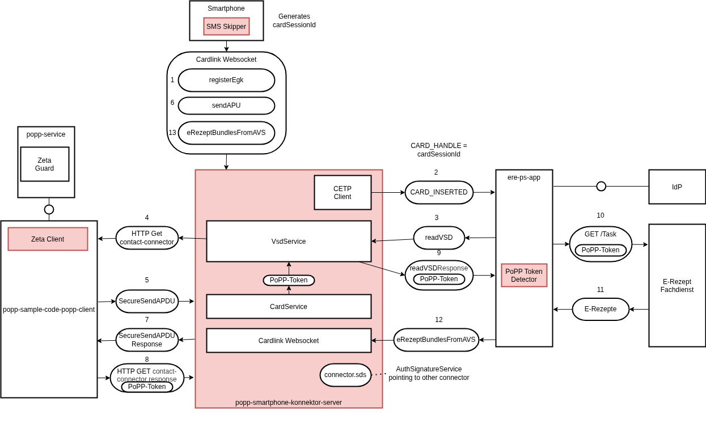
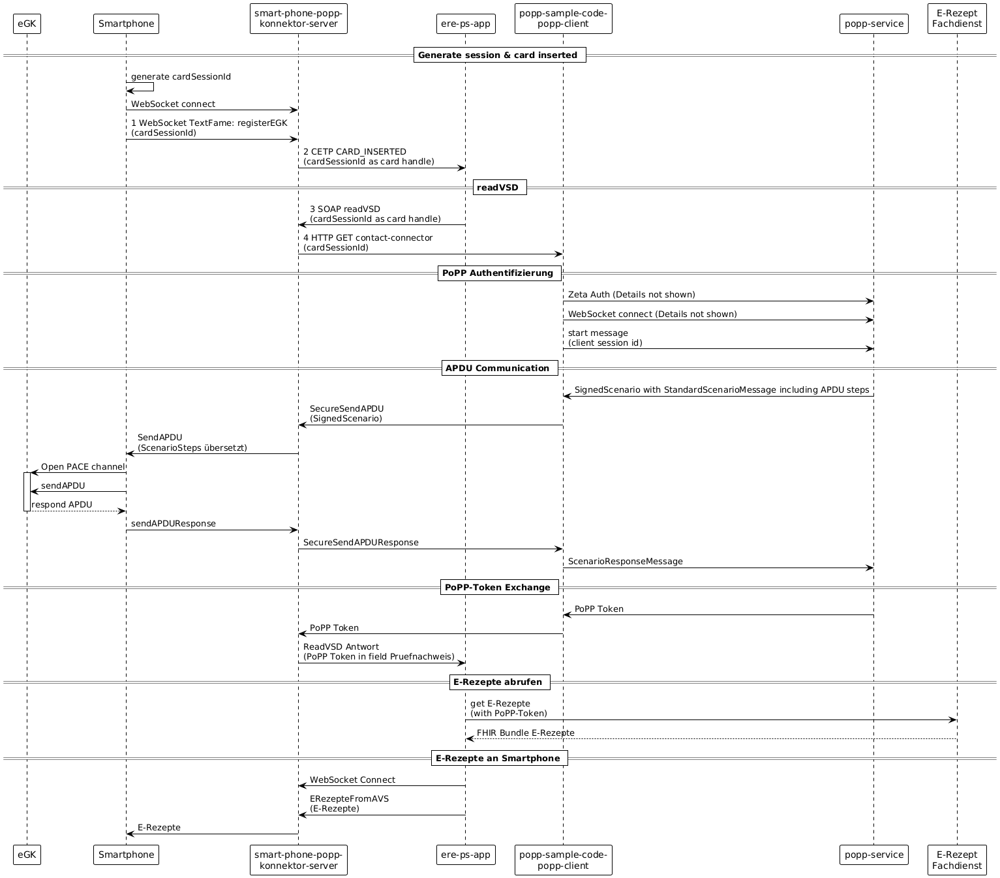
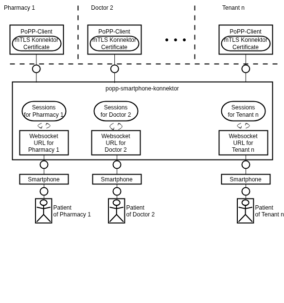

# popp-smartphone-konnektor



This project implements a software server that implements multiple given interfaces to transfer e-prescriptions to smartphones. The following is necessary for this:

1. Implement the Cardlink websocket (phone) procotol  
  1.2. Extensions from service health erx GmbH cardlink (ERezeptFromAVS)  
2. Implement multiple Konnektor interfaces:  
  2.1. CETP Client so send CARD_INSERTED  
  2.2. EventService to handle Subscribe requests correctly  
  2.3. CardService to execute SecureSendAPDU
3. popp data structures to execute a SignedScenario

## Sequence diagram



The diagram above shows the complete flow through all systems from the start where the phone connects via websocket to the popp-smartphone-konnektor until it receives the ERezeptFromAVS message.

## Multitenancy



The system creates for every popp-client that connects via a mTLS connection based on attributes in the TLS certificate an own session store and an own URL where the phones can connect.

## Development

Compiling and running on a dev machine:

```bash
./mvn-install.sh
cd server
./mvn-quarkus-dev.sh
```

## Testing in minikube

```bash
# Point to Minikube's Docker
eval $(minikube docker-env)

# Build image
mvn clean package

# Verify image exists in Minikube
minikube ssh docker images | grep popp-smartphone-konnektor

# Delete and recreate pod (Delete not needed if created first time)
kubectl delete -f kubernetes.yaml
kubectl apply -f kubernetes.yaml

# Access
minikube service popp-smartphone-konnektor --url
```
